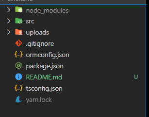

# APIRest em Node com Typescript com SQLite
### Anotações de aprendizado da 3# NLW da rocketseat

## Diretório Raiz

<p align="center">
  
</p>

## Comentários sobre cada arquivo


## package.json

```
{
  "name": "backend",
  "version": "1.0.0",
  "main": "index.js",
  "license": "MIT",
  "scripts": {
    "dev": "ts-node-dev --transpile-only --ignore-watch node_modules src/server.ts",
    "typeorm": "ts-node-dev ./node_modules/typeorm/cli.js"
  },
  "dependencies": {
    "cors": "^2.8.5",
    "express": "^4.17.1",
    "express-async-errors": "^3.1.1",
    "multer": "^1.4.2",
    "sqlite3": "^5.0.0",
    "typeorm": "^0.2.28",
    "typescript": "^4.0.3",
    "yup": "^0.29.3"
  },
  "devDependencies": {
    "@types/cors": "^2.8.8",
    "@types/express": "^4.17.s8",
    "@types/multer": "^1.4.4",
    "@types/yup": "^0.29.8",
    "ts-node-dev": "^1.0.0-pre.65"
  }
}

```

* [express](https://expressjs.com/pt-br/):  _é um framework para aplicações web para Node.js_
* [typescript](https://www.npmjs.com/package/typescript): _para pode usar Typescript com node_
* [cors](https://www.npmjs.com/package/cors): _habilitar cors na api_
* [express-async-errors](https://www.npmjs.com/package/express-async-errors): _o express ele não trata exeção com isso vai facilitar a manipular os errors_
* [typeorm](https://typeorm.io/#/): _vai facilitar a mapear objetos para o banco de dados usando javascript_
* [multer](https://www.npmjs.com/package/multer): _Multer é um middleware node.js para lidar com multipart / form-data, que é usado principalmente para fazer upload de arquivos. É escrito no topo do busboy para máxima eficiência._ 
* [sqlite3](https://www.npmjs.com/package/sqlite3): _Banco de dados relacional embutido_
* [yup](https://www.npmjs.com/package/yup): _é um construtor de esquema JavaScript para análise e validação de valor_

## Diretorio src

<p align="center">
    
</p>

### server.ts

```
    import express from 'express';
    import 'express-async-errors';
    import path from 'path';
    // path fornece utilitários para trabalhar com caminhos de arquivo e diretório
    import cors from 'cors';

    import './database/connection';
    import routes from './routes';
    import errorHandler from './errors/handler';

    const app = express();

    app.use(cors()); // configurar CORS
    app.use(express.json()); // faz com que nossa API possa receber JSON
    app.use(routes); // usar as rotas configuradas nesse
    // redireciona as imagens para a pasta local.
    app.use('/uploads', express.static(path.join(__dirname, '..', 'uploads'))); 
    app.use(errorHandler); // para tratamentos de errors

    app.listen(3333); // faz a API ouvir a porta 3333 e fica disponivel
```
